# RaportGen — блок-схеми всього проєкту

Цей документ показує систему на трьох рівнях: загальна карта, потоки даних між модулями та дії користувача на кожній сторінці. Схеми описують поточну реалізацію розширеної редакції; у простій редакції з основного меню лишаються «Документи» й «Особовий склад», а також системні «Налаштування» та «Попередження».

## Як читати схеми

- суцільна стрілка `→` — явна дія користувача або пряме читання даних;
- товста стрілка `⇒` — збереження у постійне сховище або створення файла;
- пунктирна стрілка `⇢` — автоматичне оновлення, синхронізація чи похідний розрахунок;
- зелені блоки — сторінки; сині — кнопки й дії; золоті — дані; фіолетові — автоматичні процеси; сірі — файли або зовнішні результати; червоні — перевірки й підтвердження.

> Повторювані кнопки «Пошук», «Фільтр», «Сортування», перемикання вкладок і розгортання секцій об’єднані в один вузол, оскільки вони змінюють лише поточне відображення й не записують дані.

## 1. Головна карта застосунку

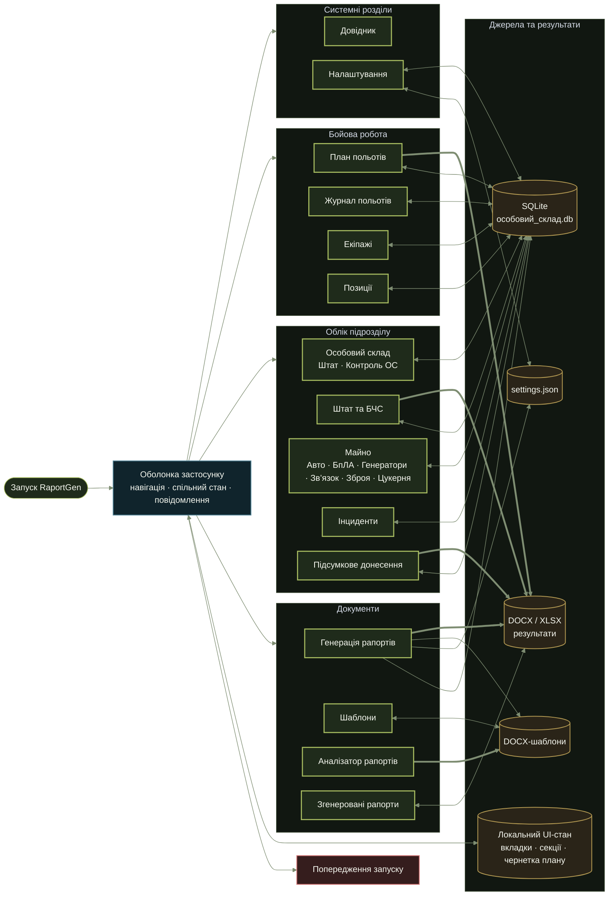

### 1.1. Зв’язки між сторінками

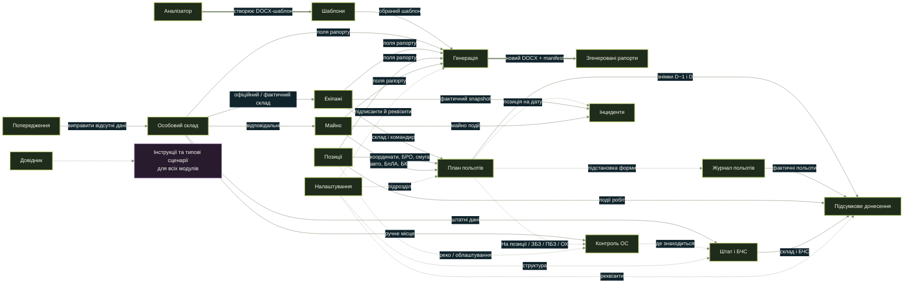

## 2. Єдине джерело правди та головні зв’язки даних

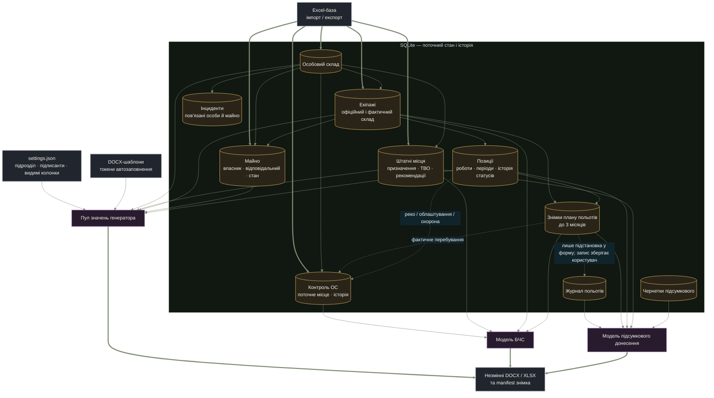

## 3. Оболонка, навігація та автоматичне оновлення

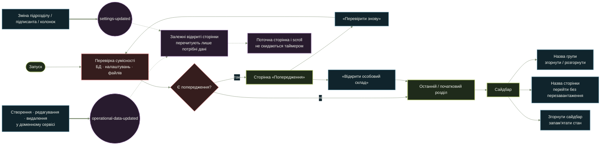

## 4. Документи: від шаблону до готового рапорту

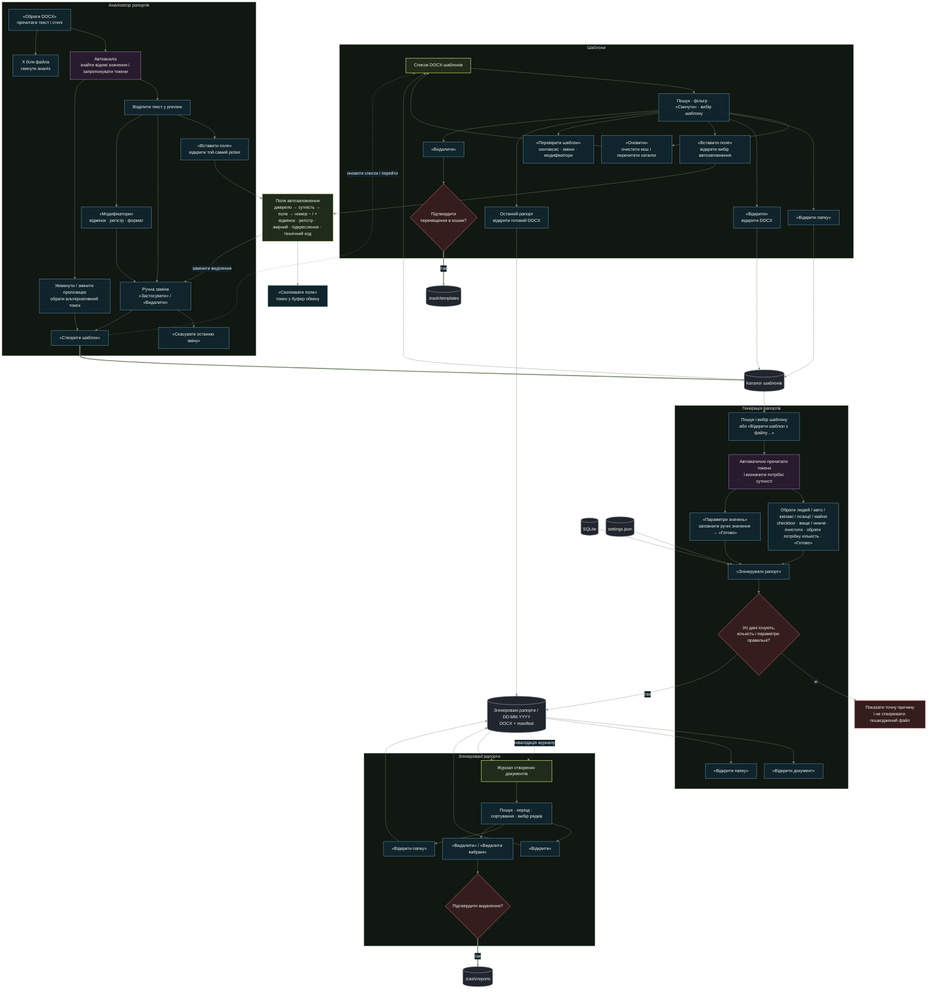

## 5. Особовий склад і контроль місця перебування

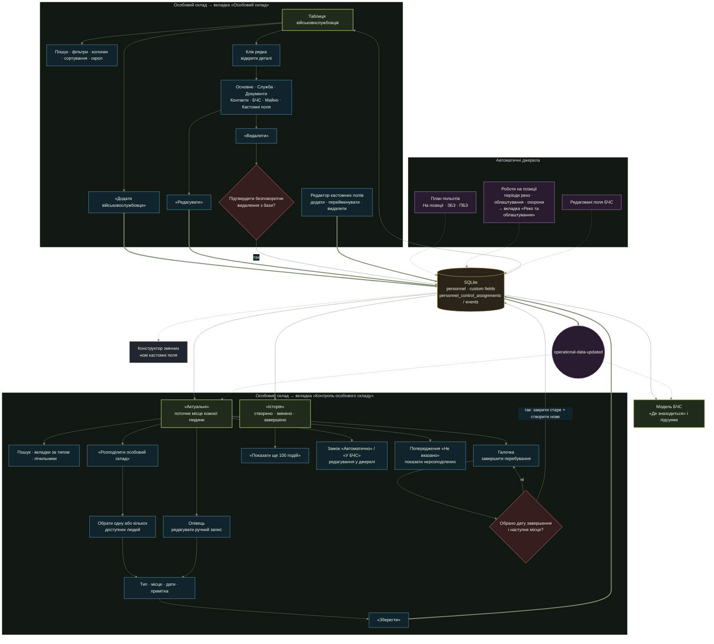

### Правила контролю ОС

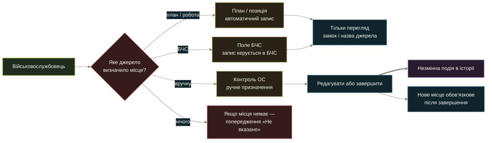

## 6. Штат і БЧС

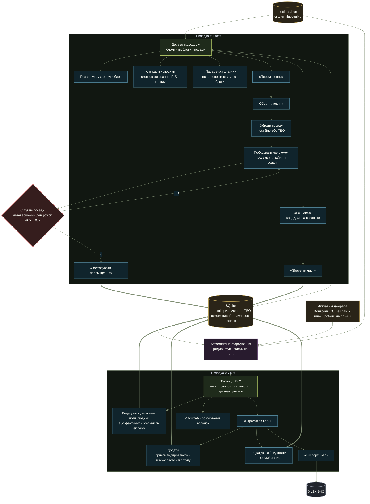

## 7. Екіпажі та позиції

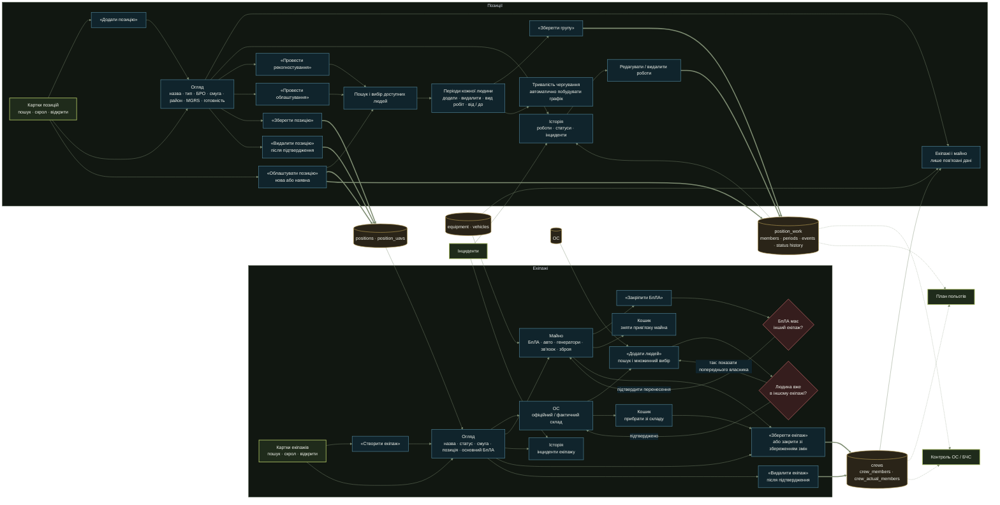

## 8. План польотів, журнал і підсумкове донесення

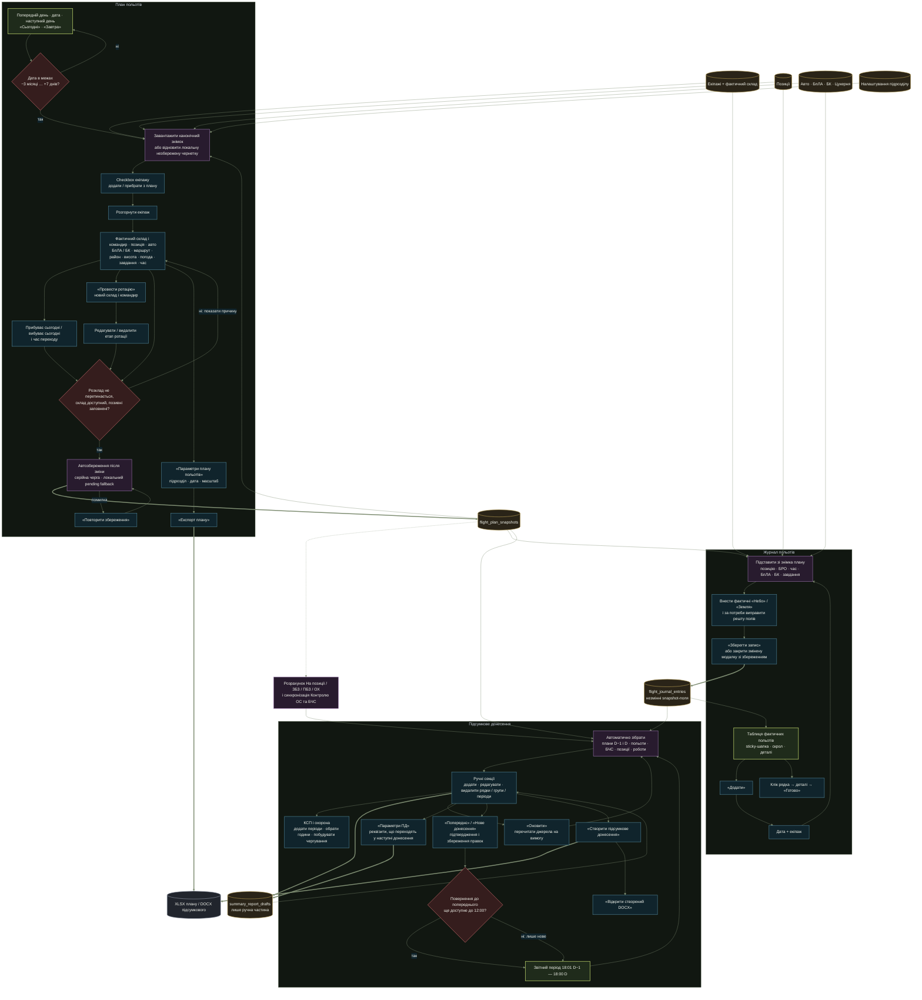

### 8.1. Ротації та перехід станів у БЧС

```mermaid
%%{init: {"theme":"base","themeVariables":{"primaryColor":"#1f2b1b","primaryTextColor":"#f5f7ef","primaryBorderColor":"#a8bd61","lineColor":"#7e8d72","secondaryColor":"#10242c","tertiaryColor":"#2a2418","clusterBkg":"#111711","clusterBorder":"#3e4d36","fontFamily":"Inter, Arial, sans-serif"},"flowchart":{"curve":"basis","nodeSpacing":30,"rankSpacing":52,"htmlLabels":true}}}%%
flowchart LR
  previous["Попередній план<br/>екіпаж на позиції"]
  current{"Що вказано<br/>у плані на дату?"}
  continues["Екіпаж продовжує роботу"]
  incoming["Новий екіпаж прибуває<br/>або входить у ротацію"]
  outgoing["Попередній екіпаж вибуває<br/>у вказаний час"]
  position["На позиції"]
  zbz["ЗБЗ"]
  pbz["ПБЗ"]
  nextDay["Наступна доба"]
  ox["ОХ"]
  workPriority{"Є активне реко /<br/>облаштування?"}
  work["Реко та облаштування<br/>має вищий пріоритет"]

  previous --> current
  current -->|"той самий склад"| continues --> position
  current -->|"заїзд"| incoming --> zbz
  current -->|"виїзд"| outgoing --> pbz
  zbz --> nextDay --> position
  pbz --> nextDay --> ox
  position --> workPriority
  zbz --> workPriority
  pbz --> workPriority
  workPriority -->|"так"| work
  workPriority -->|"ні"| position

  class previous,current page;
  class continues,incoming,outgoing,nextDay auto;
  class position,zbz,pbz,ox,work data;
  class workPriority warn;
  classDef page fill:#1f2b1b,stroke:#a8bd61,color:#f5f7ef,stroke-width:2px;
  classDef data fill:#2a2418,stroke:#b59b53,color:#f5f7ef,stroke-width:1.5px;
  classDef auto fill:#281b2e,stroke:#9470a7,color:#f5f7ef,stroke-width:1.5px;
  classDef warn fill:#351d1d,stroke:#cf7070,color:#f5f7ef,stroke-width:1.5px;
```

## 9. Майно: усі вкладки та прив’язки

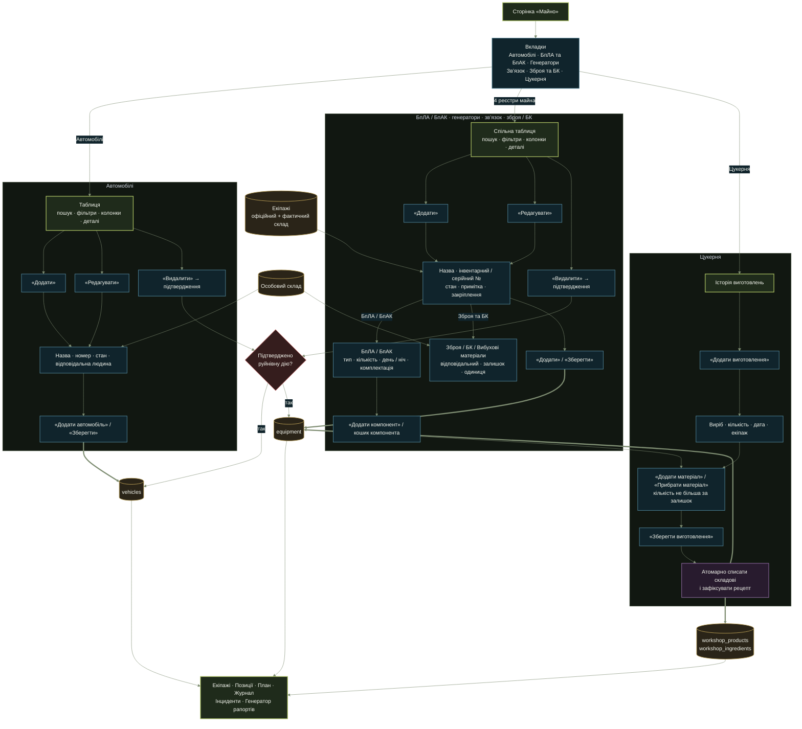

## 10. Інциденти

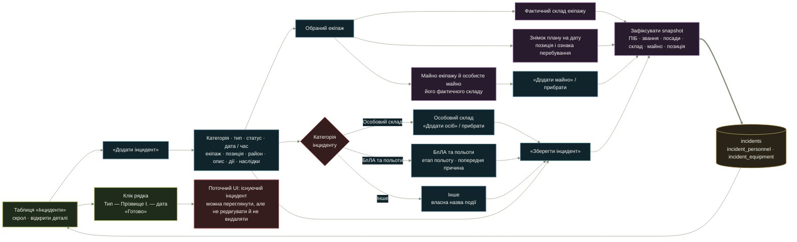

## 11. Налаштування, імпорт, експорт і резервування

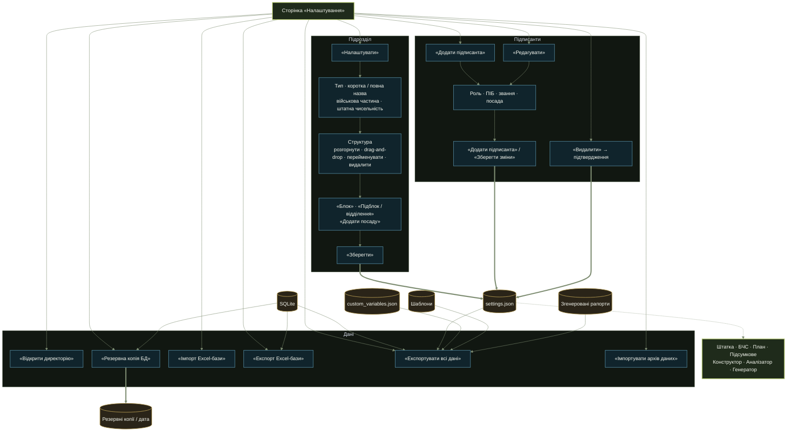

### Excel: сумісний імпорт старих і нових баз

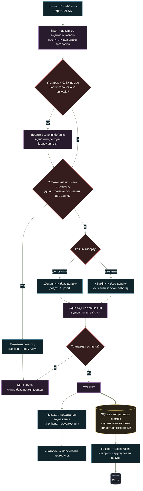

### Повний ZIP-архів і безпечне відновлення

```mermaid
%%{init: {"theme":"base","themeVariables":{"primaryColor":"#1f2b1b","primaryTextColor":"#f5f7ef","primaryBorderColor":"#a8bd61","lineColor":"#7e8d72","secondaryColor":"#10242c","tertiaryColor":"#2a2418","clusterBkg":"#111711","clusterBorder":"#3e4d36","fontFamily":"Inter, Arial, sans-serif"},"flowchart":{"curve":"basis","nodeSpacing":28,"rankSpacing":52,"htmlLabels":true}}}%%
flowchart LR
  exportButton["«Експортувати всі дані»"]
  selectParts["Обрати склад архіву<br/>БД · налаштування · кастомні поля · шаблони · рапорти"]
  create["«Створити архів»"]
  manifest["Manifest<br/>версія · перелік · розмір · SHA-256"]
  zip[("ZIP")]

  importButton["«Імпортувати архів даних»"]
  stage["Розпакувати у staging"]
  verify{"Безпечні шляхи, ліміти,<br/>manifest, hash, JSON і SQLite quick_check правильні?"}
  backup["Автоматично скопіювати<br/>поточні замінювані дані"]
  install["Встановити файли<br/>і виконати міграції БД"]
  reopen{"Нові дані<br/>успішно відкрились?"}
  rollback["Rollback<br/>повернути попередні файли"]
  reload["Перезапустити UI"]

  exportButton --> selectParts --> create --> manifest ==> zip
  zip --> importButton --> stage --> verify
  verify -->|"ні"| rollback
  verify -->|"так"| backup --> install --> reopen
  reopen -->|"ні"| rollback
  reopen -->|"так"| reload

  class exportButton,selectParts,create,importButton action;
  class manifest,stage,backup,install,reload auto;
  class zip file;
  class verify,reopen,rollback warn;
  classDef action fill:#10242c,stroke:#4f8296,color:#f5f7ef,stroke-width:1.5px;
  classDef auto fill:#281b2e,stroke:#9470a7,color:#f5f7ef,stroke-width:1.5px;
  classDef file fill:#21252d,stroke:#9298a6,color:#f5f7ef,stroke-width:1.5px;
  classDef warn fill:#351d1d,stroke:#cf7070,color:#f5f7ef,stroke-width:1.5px;
```

## 12. Довідник і попередження

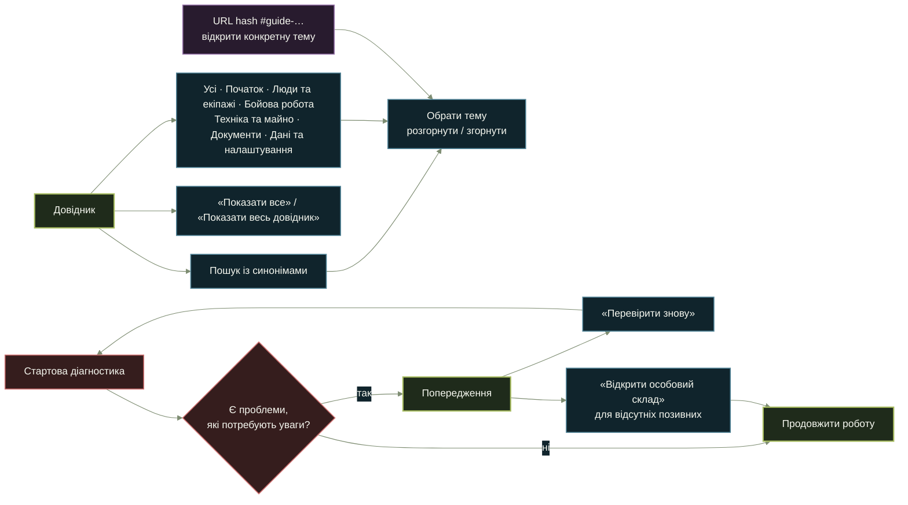

## 13. Технічний шлях кожної дії

```mermaid
%%{init: {"theme":"base","themeVariables":{"primaryColor":"#1f2b1b","primaryTextColor":"#f5f7ef","primaryBorderColor":"#a8bd61","lineColor":"#7e8d72","secondaryColor":"#10242c","tertiaryColor":"#2a2418","clusterBkg":"#111711","clusterBorder":"#3e4d36","fontFamily":"Inter, Arial, sans-serif"},"flowchart":{"curve":"basis","nodeSpacing":28,"rankSpacing":52,"htmlLabels":true}}}%%
flowchart LR
  user(["Користувач"])
  button["Кнопка / поле / рядок у React"]
  local{"Дія лише змінює<br/>відображення?"}
  uiState["React state / localStorage<br/>пошук · вкладка · секція · масштаб"]
  service["Типізований frontend service"]
  invoke["Tauri invoke"]
  command["Rust command<br/>валідація · нормалізація · транзакція"]
  target{"Куди записуємо?"}
  sqlite[("SQLite")]
  json[("settings.json<br/>custom_variables.json")]
  files[("DOCX · XLSX · ZIP<br/>каталоги програми")]
  result["Результат / помилка"]
  notification["Toast або field-level помилка"]
  event{"Чи команда поширює<br/>подію інвалідації?"}
  operationEvent(("operational-data-updated"))
  settingsEvent(("settings-updated"))
  generatedEvent(("generated-reports-changed"))
  reload["Залежні сторінки перечитують дані"]

  user --> button --> local
  local -->|"так"| uiState
  local -->|"ні"| service --> invoke --> command --> target
  target -->|"облік"| sqlite
  target -->|"налаштування"| json
  target -->|"документ / архів"| files
  sqlite --> result
  json --> result
  files --> result
  result --> notification
  result --> event
  event -->|"операційна мутація"| operationEvent --> reload
  event -->|"налаштування"| settingsEvent --> reload
  event -->|"новий / видалений рапорт"| generatedEvent --> reload
  event -->|"події немає"| notification

  class button,service,invoke,command,notification,reload action;
  class uiState,operationEvent,settingsEvent,generatedEvent auto;
  class sqlite,json data;
  class files file;
  class local,target,event warn;
  classDef action fill:#10242c,stroke:#4f8296,color:#f5f7ef,stroke-width:1.5px;
  classDef data fill:#2a2418,stroke:#b59b53,color:#f5f7ef,stroke-width:1.5px;
  classDef auto fill:#281b2e,stroke:#9470a7,color:#f5f7ef,stroke-width:1.5px;
  classDef file fill:#21252d,stroke:#9298a6,color:#f5f7ef,stroke-width:1.5px;
  classDef warn fill:#351d1d,stroke:#cf7070,color:#f5f7ef,stroke-width:1.5px;
```

### Спільна поведінка модальних вікон

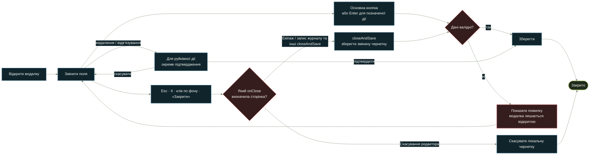

## 14. Автоматичні перерахунки та «читання з побічними ефектами»

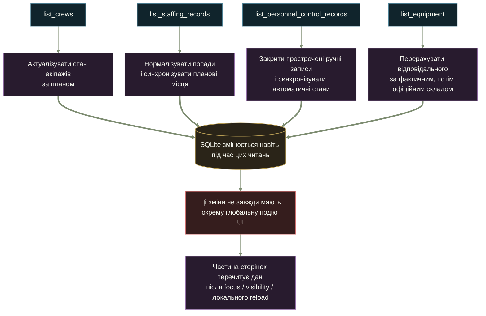

## 15. Важливі межі поточної реалізації

```mermaid
%%{init: {"theme":"base","themeVariables":{"primaryColor":"#1f2b1b","primaryTextColor":"#f5f7ef","primaryBorderColor":"#a8bd61","lineColor":"#7e8d72","secondaryColor":"#10242c","tertiaryColor":"#2a2418","clusterBkg":"#111711","clusterBorder":"#3e4d36","fontFamily":"Inter, Arial, sans-serif"},"flowchart":{"curve":"basis","nodeSpacing":30,"rankSpacing":52,"htmlLabels":true}}}%%
flowchart TB
  excelReplace["Excel «Замінити базу»"]
  clears["Очищає також плани, журнал, чернетки ПД,<br/>роботи на позиціях і Цукерню"]
  notExported["Ці дані не входять до Excel-експорту"]
  riskLoss["Ризик втрати операційної історії<br/>для повного перенесення слід використовувати ZIP"]

  journal["Журнал польотів"]
  journalLimit["Наразі лише створення і перегляд<br/>без редагування та видалення"]
  incidents["Інциденти"]
  incidentLimit["Наразі лише створення і перегляд<br/>без редагування та видалення"]

  vehicle["Синхронізація авто під час імпорту / ОС"]
  vehicleRisk["Поточний legacy-шлях може відкріпити авто,<br/>якщо назва посади не містить «водій»"]

  events["Глобальні події оновлення"]
  eventLimit["ОС, авто й частина Контролю ОС<br/>використовують прямий invoke без єдиної інвалідації"]

  excelReplace --> clears
  excelReplace --> notExported
  clears --> riskLoss
  notExported --> riskLoss
  journal --> journalLimit
  incidents --> incidentLimit
  vehicle --> vehicleRisk
  events --> eventLimit

  class excelReplace,journal,incidents,vehicle,events page;
  class clears,notExported,riskLoss,journalLimit,incidentLimit,vehicleRisk,eventLimit warn;
  classDef page fill:#1f2b1b,stroke:#a8bd61,color:#f5f7ef,stroke-width:2px;
  classDef warn fill:#351d1d,stroke:#cf7070,color:#f5f7ef,stroke-width:1.5px;
```

## Покриття схем

| Розділ застосунку | Детальна схема |
|---|---:|
| Генерація рапортів, Шаблони, Аналізатор, Згенеровані рапорти, Поля автозаповнення | 4 |
| Особовий склад, Контроль особового складу | 5 |
| Штат, БЧС, переміщення, ТВО, рекомендації | 6 |
| Екіпажі, Позиції, рекогностування й облаштування | 7 |
| План польотів, ротації, Журнал польотів, Підсумкове донесення | 8 |
| Автомобілі, БпЛА/БпАК, Генератори, Зв’язок, Зброя/БК, Цукерня | 9 |
| Інциденти | 10 |
| Налаштування, Excel, ZIP, резервні копії | 11 |
| Довідник, Попередження | 12 |
| Спільні кнопки, модалки, backend, події та ризики | 13–15 |
