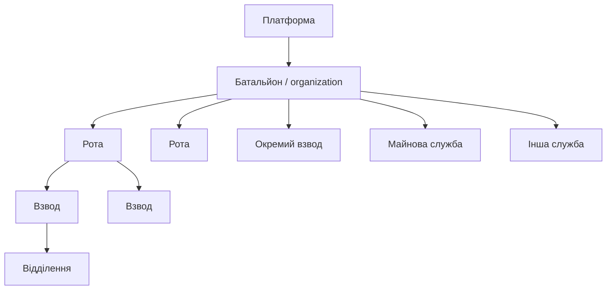
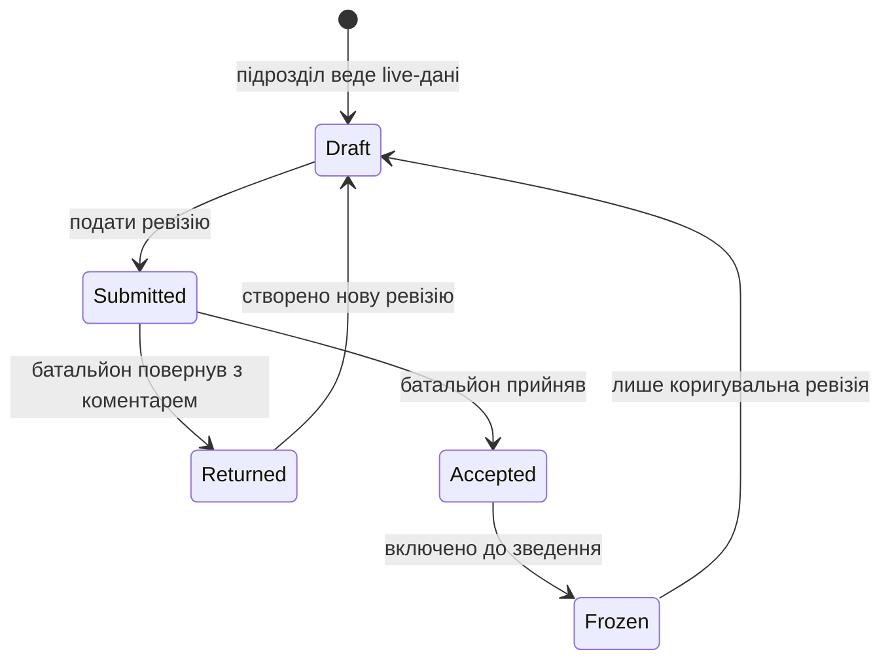
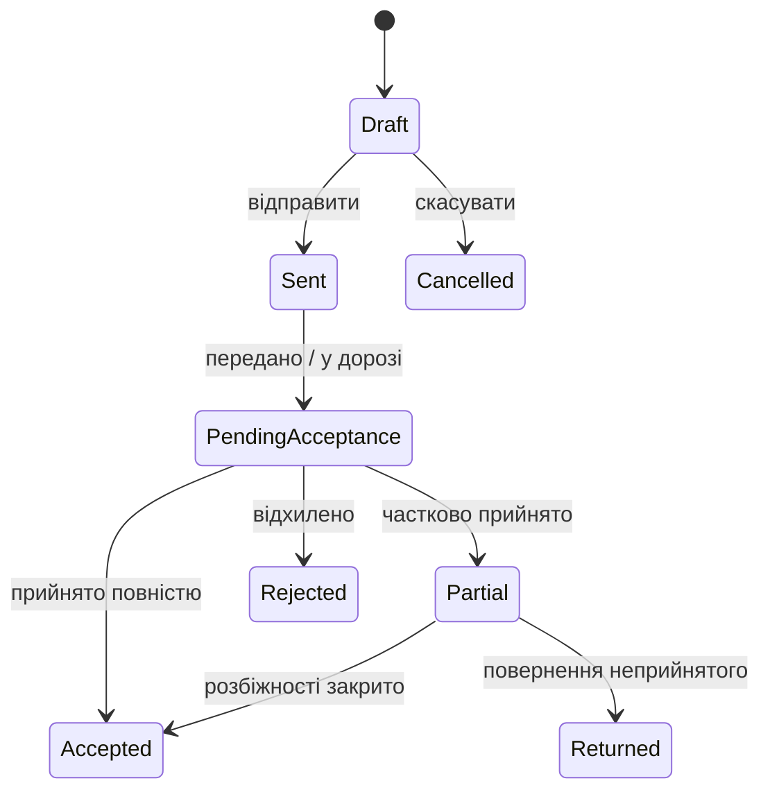

# ТЗ: багатопідроздільна платформа RaportGen на Supabase

**Статус:** концепція для погодження перед реалізацією  
**Версія:** 1.0  
**Дата:** 17.09.2026  
**Обсяг:** акаунти, ролі, батальйон, роти, окремі взводи, майнові служби, адміністрування, аудит, синхронізація та міграція чинних даних

## 1. Мета

Перетворити поточний локальний desktop-застосунок одного підрозділу на єдину платформу, у якій:

- роти й окремі взводи ведуть власні оперативні дані;
- майнові служби ставлять майно на облік і фіксують незмінний ланцюг його руху;
- підрозділ-одержувач окремо підтверджує приймання майна;
- батальйон контролює всі підрозділи, бачить live-стан і формує офіційні зведення з поданих версій;
- адміністратор керує акаунтами, ролями, функціональністю та аудитом;
- робота не руйнується при нестабільному зв’язку;
- старі SQLite-бази й Excel-файли мігрують без втрати даних.

Це ТЗ не передбачає негайного видалення SQLite. На першому етапі Supabase/Postgres стає центральним джерелом спільних даних, а SQLite — зашифрованим локальним кешем і чергою змін.

## 2. Межі першої версії

### Входить

1. Ієрархія батальйону та підрозділів.
2. Акаунти, кілька ролей і кілька робочих контекстів для однієї людини.
3. Серверні права доступу до кожного запису.
4. Кабінет батальйону та перехід до даних кожного підрозділу.
5. Подання, повернення, приймання й версії офіційних даних.
6. Облік і двостороннє переміщення майна.
7. Адмінська матриця функцій і прав.
8. Журнал бізнес- та адміністративних дій.
9. Offline-first синхронізація desktop-застосунку.
10. Міграція чинних SQLite/Excel-даних.
11. Рольовий Довідник і правила його обов’язкового оновлення.

### Не входить до першої версії

- кваліфікований електронний підпис;
- автоматичне розпізнавання всіх накладних і рапортів;
- окремий мобільний застосунок;
- зовнішні інтеграції з іншими інформаційними системами;
- прогнозна аналітика або ШІ-рекомендації;
- остаточні алгоритми всіх типів інцидентів — для них уже є окреме ТЗ.

Ці можливості мають бути можливими без перебудови базової моделі.

## 3. Непорушні принципи

1. **Один запис — одне джерело правди.** Батальйон не створює копії даних роти, а читає її записи або зафіксовані версії.
2. **Назва ролі не є захистом.** Реальний доступ перевіряється сервером через permission, scope, строк дії, стан функції та стан бізнес-об’єкта.
3. **Прихована кнопка не є безпекою.** Навіть прямий REST/RPC/Storage-запит не повинен повертати чужі дані.
4. **Live-стан і офіційна звітність розділені.** Командування може бачити актуальну картину, але офіційне зведення формується лише з конкретних поданих/прийнятих ревізій.
5. **Історію не переписують.** Подані документи, журнали, інцидентні події, рух майна й аудит є версійними або append-only.
6. **Критична операція атомарна.** Приймання майна, подання документа, зміна прав і фіксація звіту або виконуються повністю, або не виконуються взагалі.
7. **Offline не означає безконтрольне редагування.** Чернетки можна готувати локально; спільні переходи стану завершуються сервером.
8. **Сумісність є умовою релізу.** Нова версія автоматично готує старі дані або показує зрозумілий recovery-екран, а не чорний екран.
9. **Довідник є частиною функції.** Нова поведінка без оновленої інструкції й тесту Довідника не вважається завершеною.

## 4. Організаційна модель

### 4.1. Ієрархія



- `organization` — окремий ізольований контур батальйону.
- `organizational_unit` — вузол дерева: `battalion`, `company`, `platoon`, `separate_platoon`, `service`, `department`, `other`.
- Один технічний проєкт може в майбутньому обслуговувати кілька батальйонів, але жоден звичайний акаунт не перетинає межі `organization` без окремого членства.
- Для доступу до всього піддерева використовується `unit_closure(ancestor_unit_id, descendant_unit_id, depth)`, яку змінює лише серверна транзакція.

### 4.2. Обов’язкові властивості підрозділу

- UUID;
- належність до батальйону;
- батьківський підрозділ;
- тип;
- коротка і повна назви;
- внутрішній код;
- строк активності;
- параметри документів;
- штатна структура;
- дозволені модулі;
- часовий пояс і правила оперативної доби.

### 4.3. Поточний контекст користувача

В шапці застосунку постійно показуються:

- батальйон;
- поточний підрозділ або «Весь батальйон»;
- активна роль;
- оперативна дата;
- стан синхронізації.

Один користувач не отримує кілька акаунтів через кілька функцій. Він отримує кілька членств/ролей і перемикає контекст. Перемикання не розширює права, а лише звужує робочу область.

## 5. Ролі, permissions і scope

### 5.1. Рекомендовані базові ролі

| Роль | Типовий scope | Призначення |
|---|---|---|
| Адміністратор платформи | платформа | акаунти, технічні параметри, глобальні функції, аудит |
| Адміністратор батальйону | один батальйон | структура, локальні користувачі, ролі, довідники |
| Командування батальйону | весь батальйон | перегляд і контроль усіх доменів, приймання/повернення звітів |
| Оператор батальйону | весь батальйон або окремі модулі | підготовка зведень і контроль повноти |
| Командир підрозділу | підрозділ і, за потреби, нащадки | контроль, подання, погодження даних підрозділу |
| Оператор підрозділу | один підрозділ | щоденне ведення дозволених модулів |
| Керівник майнової служби | служба та її категорії | первинний облік, рух, контроль розбіжностей |
| Оператор майнової служби | служба та її категорії | створення карток і передач |
| Приймальник майна | підрозділ-одержувач | прийняти, частково прийняти або відхилити передачу |
| Аудитор | визначена область | читання й аудит без зміни даних |

### 5.2. Permission-каталог

Права задаються діями, а не одним прапорцем «доступ до модуля». Приклади:

- `personnel.read`, `personnel.update`, `personnel.export`;
- `bcs.read`, `bcs.update`, `bcs.submit`;
- `crew.read`, `crew.update`;
- `flight_plan.read`, `flight_plan.update`, `flight_plan.submit`, `flight_plan.accept`;
- `flight_journal.read`, `flight_journal.update`, `flight_journal.freeze`;
- `summary.read`, `summary.update`, `summary.submit`, `summary.return`, `summary.accept`, `summary.freeze`;
- `assets.read`, `assets.create`, `assets.transfer.send`, `assets.transfer.accept`, `assets.adjust`;
- `incidents.read`, `incidents.update`, `incidents.close`;
- `audit.read`, `audit.export`;
- `users.manage`, `permissions.manage`, `features.manage`.

### 5.3. Формула ефективного доступу

```text
активне членство
+ permission базової ролі
+ область підрозділів (scope)
+ індивідуальний тимчасовий дозвіл
− явна заборона
− вимкнена функція
− обмеження стану об’єкта
− вимога MFA для критичної дії
```

Роль є шаблоном, а не жорстко зашитою поведінкою. Один користувач може мати різні ролі у різних підрозділах. Кожен тимчасовий дозвіл має строк і причину.

### 5.4. Адміністратор і чутливі дані

Рекомендована модель: технічний адміністратор керує системою, але не отримує автоматичний повний доступ до оперативних/медичних даних. Для перегляду потрібне окреме право. Аварійний режим `break-glass`:

- вимагає MFA;
- вимагає причину;
- має короткий строк;
- створює критичну подію аудиту;
- повідомляє відповідального адміністратора батальйону.

Якщо потрібно, щоб адміністратор завжди бачив усе, це має бути окремим усвідомленим рішенням, а не побічним ефектом ролі.

## 6. Керування функціональністю

Адміністратор може встановити для модуля режим:

- **Повний доступ**;
- **Лише перегляд**;
- **Вимкнено**.

Рівні налаштування:

1. платформа;
2. батальйон;
3. тип підрозділу;
4. конкретний підрозділ;
5. роль;
6. конкретний користувач.

Правила:

- системне аварійне блокування має найвищий пріоритет;
- явна заборона перемагає успадкований дозвіл;
- індивідуальний дозвіл не може увімкнути те, що вимкнено для всього батальйону;
- кожна зміна має причину, автора, строк дії та попередній перегляд, кого вона зачепить;
- аудит, вхід, профіль, довідник і пояснення блокування вимкнути не можна;
- система не дозволяє заблокувати останнього активного адміністратора;
- UI приховує недоступний модуль, але сервер однаково відмовляє в доступі.

## 7. Джерела правди за доменами

| Домен | Хто веде | Що бачить батальйон | Офіційне джерело для зведень |
|---|---|---|---|
| Особовий склад і штат | рота/взвод | live + подана версія | прийнятий snapshot |
| БЧС | рота/взвод | live-стан із часом актуальності | поданий/прийнятий добовий snapshot |
| Офіційний склад екіпажу | рота/взвод | повний перелік | чинний часовий зв’язок |
| Фактична робота в екіпажі | рота/взвод | поточний стан і історія | snapshot плану/журналу на подію |
| Позиції та роботи | рота/взвод | live та історія подій | зафіксовані події/періоди |
| План польотів | рота/взвод | live-чернетка за правом + подані ревізії | опублікована/прийнята ревізія |
| Журнал польотів | рота/взвод | записи з джерелом і актуальністю | зафіксовані записи журналу |
| Майно | профільна служба, після приймання — підрозділ | зведення та ledger | незмінний ledger |
| Інциденти | підрозділ-власник процесу | контроль етапів | зареєстрована версія та події |
| Підсумкове | підрозділ; зведене — батальйон | статуси й ревізії | конкретні прийняті ревізії |
| Права й функції | адміністратор | журнал змін | серверна конфігурація + audit |

Нульове значення завжди відрізняється від «дані не подано».

## 8. Кабінет батальйону

### 8.1. Призначення

Батальйонний акаунт не дублює роботу рот. Його завдання:

- бачити загальний стан;
- знаходити неповні, суперечливі або прострочені дані;
- переходити від показника до першоджерела;
- повертати подання на виправлення;
- приймати й фіксувати версії;
- формувати спільні документи;
- аналізувати стан у розрізі підрозділів і періодів.

### 8.2. Основні вкладки

1. Огляд.
2. Штат і БЧС.
3. Бойова робота.
4. Плани польотів.
5. Журнал польотів.
6. Позиції й екіпажі.
7. Майно.
8. Інциденти.
9. Зведені донесення.
10. Аналітика.
11. Якість даних.
12. Журнал дій.

### 8.3. Обов’язкові атрибути кожного агрегату

- підрозділ-джерело;
- час актуальності `as_of`;
- live чи submitted/accepted snapshot;
- номер ревізії;
- стан подання;
- перелік підрозділів без даних;
- перехід до первинних записів.

### 8.4. Live-контроль і офіційні зведення

Командування може бачити live-дані, якщо має право. Вони позначаються тегом «Оперативні, не подані».

Офіційний процес:



Зведене підсумкове зберігає точний список `unit_submission_id` і ревізій, з яких його сформовано. Пізніше редагування live-даних не змінює вже сформований документ.

### 8.5. Повноваження батальйону

За замовчуванням батальйон:

- читає;
- коментує;
- повертає;
- приймає;
- фіксує зведення;
- експортує дозволені дані.

Батальйон не повинен непомітно виправляти джерельний запис роти. Аварійна корекція можлива лише окремим permission, із причиною, before/after і сповіщенням підрозділу.

## 9. Майнова служба й переміщення майна

### 9.1. Модель обліку

Потрібно розділяти:

- номенклатуру/модель;
- серійну облікову одиницю;
- партію кількісного майна;
- облікового власника;
- фактичного утримувача;
- місце зберігання;
- матеріально відповідальну особу;
- стан;
- доступний, зарезервований і фактичний залишок.

Передача не створює копію майна. Вона створює події руху єдиного запису.

### 9.2. Стани передачі



### 9.3. Сценарій

1. Служба реєструє майно/партію на своєму балансі.
2. Обирає підрозділ-одержувач і додає позиції.
3. Система перевіряє наявність, власника й відсутність іншої активної передачі.
4. Вказуються документ-підстава, відповідальні та дата.
5. Після `send` майно резервується, але власник ще не змінюється.
6. Одержувач отримує завдання «Очікує приймання».
7. По кожному рядку він фіксує кількість, серійний номер, стан і розбіжність.
8. `accept` однією серверною транзакцією:
   - створює ledger;
   - змінює баланс/власника/утримувача;
   - закриває рядки;
   - створює аудит;
   - сповіщає сторони.
9. Частково прийнята передача залишається відкритою до вирішення всіх рядків.

### 9.4. Виправлення

Після фактичного руху не дозволяється редагувати старий ledger. Помилка виправляється сторнувальною/зворотною операцією з причиною й посиланням на первинну подію.

### 9.5. Подальше закріплення

Після приймання оператор підрозділу, а не служба, закріплює майно за екіпажем, позицією або відповідальною особою. Служба бачить результат у межах свого майнового права, але не редагує екіпажі чи БЧС.

## 10. Адміністратор

### 10.1. Функції

- створення/запрошення, блокування, відновлення акаунтів;
- членства в батальйонах і підрозділах;
- ролі, permissions, scope, тимчасові дозволи;
- увімкнення/вимкнення функцій;
- реєстр пристроїв і завершення сесій;
- журнал дій;
- контроль міграцій і синхронізації;
- довідники й системні параметри;
- recovery-операції за окремим критичним правом.

### 10.2. Матриця доступу

Для кожної дії UI показує не лише checkbox, а джерело ефективного права:

- успадковано від ролі;
- успадковано від підрозділу;
- дозволено явно;
- заборонено явно;
- тимчасово до дати;
- заблоковано системно.

Перед збереженням адміністратор бачить, кого зачепить зміна. Критична зміна вимагає причину й MFA.

## 11. Журнал дій

### 11.1. Вкладки

- Усі;
- Акаунти й доступи;
- Особовий склад;
- Штат;
- БЧС;
- Екіпажі;
- Позиції;
- Плани польотів;
- Журнал польотів;
- Майно й передачі;
- Інциденти;
- Підсумкове;
- Документи;
- Налаштування;
- Експорт і перегляд чутливих даних.

### 11.2. Подія аудиту

`audit_events` є append-only і містить:

- час;
- батальйон і підрозділ;
- користувача, активну роль і членство;
- модуль, дію, тип та UUID об’єкта;
- результат;
- причину;
- безпечний before/after diff;
- request ID та idempotency key;
- пристрій, сесію, IP і user agent;
- джерело: UI, імпорт, синхронізація, RPC, міграція.

Клієнт не має права самостійно вставляти, змінювати або видаляти аудит. Його створює серверна функція/тригер у межах тієї самої транзакції, що й бізнес-дію.

### 11.3. Що логувати

Обов’язково:

- створення, зміни, архівування;
- зміни зв’язків;
- подання, повернення, приймання, фіксацію;
- весь рух майна;
- зміни ролей, scope і функцій;
- вхід, невдалі спроби, блокування, завершення сесій;
- перегляд/експорт чутливих даних;
- імпорт, міграцію й масові операції;
- доступ у режимі `break-glass`.

Не треба довго зберігати кожен клік, сортування, hover або відкриття звичайного меню.

### 11.4. Рекомендована стартова політика зберігання

- бізнес-зміни, рух майна, затвердження й адмінські дії — **36 місяців у швидкому пошуку**, далі зашифрований архів щонайменше до 60 місяців;
- перегляд/експорт чутливих даних — 12 місяців у швидкому пошуку, далі архів за політикою;
- входи й сесії — 180 днів;
- технічні логи синхронізації — 90 днів;
- майновий ledger, версії офіційних документів та історія інцидентів — за їхнім окремим обліковим строком, без загального автоматичного видалення.

Фізично журнал секціонується по місяцях. Остаточні строки потрібно затвердити внутрішнім нормативним рішенням.

## 12. Аналітика батальйону

Напрями:

- штат/список/наявність/відсутність і динаміка БЧС;
- готовність екіпажів, неповний склад, відсутність техніки або позиції;
- активні/резервні/облаштовувані позиції;
- заплановані, виконані, скасовані польоти й причини;
- наліт і використання БпЛА;
- наявність, справність, дефіцит, рух і прострочені передачі майна;
- інциденти, прострочені етапи й час закриття;
- подання документів вчасно/прострочено/повернуто;
- якість даних: незаповнені поля, суперечливі зв’язки, застарілі snapshots.

Правила:

- жодних декоративних метрик без переходу до записів;
- кожне число має джерело та актуальність;
- нуль відрізняється від відсутніх даних;
- персональні поля маскуються без відповідного permission;
- фільтри підрозділу/періоду/смуги однакові та зберігаються;
- важкі агрегати будуються матеріалізованими/серверними представленнями з контрольованим оновленням;
- офіційна аналітика використовує accepted snapshots, оперативна — live з чітким маркуванням.

## 13. Цільова модель даних

### 13.1. Організація й доступ

- `organizations`;
- `organizational_units`;
- `unit_closure`;
- `profiles`;
- `organization_memberships`;
- `roles`;
- `permissions`;
- `role_permissions`;
- `access_assignments`;
- `permission_overrides`;
- `feature_catalog`;
- `feature_overrides`;
- `devices`.

### 13.2. Особовий склад і бойова робота

- `personnel`;
- `personnel_unit_assignments`;
- `staff_positions`;
- `staff_assignments`;
- `acting_assignments`;
- `bcs_status_events`, `bcs_snapshots`;
- `crews`;
- `crew_official_memberships`;
- `crew_actual_work_assignments`;
- `positions`;
- `position_assignments`;
- `position_work`, `position_work_periods`, `position_work_events`;
- `flight_plans`, `flight_plan_revisions`, `flight_plan_entries`;
- `flight_journal_entries`;
- `summary_reports`, `summary_report_revisions`, `unit_submissions`;
- `incidents`, `incident_people`, `incident_assets`, `incident_steps`.

### 13.3. Майно

- `asset_categories`;
- `asset_catalog_items`;
- `asset_instances` для серійних одиниць;
- `asset_lots` для кількісних партій;
- `asset_balances`;
- `asset_custody`;
- `asset_transfers`;
- `asset_transfer_items`;
- `asset_transfer_events`;
- `asset_ledger`.

### 13.4. Документи, аудит і синхронізація

- `documents`, `document_versions`, `file_objects`;
- `audit_events`;
- `sync_changes`;
- `mutation_receipts`;
- `notifications`;
- `import_batches`, `import_errors`, `legacy_id_map`.

### 13.5. Обов’язкові системні поля

Кожен бізнес-запис має:

- `id UUID`;
- `organization_id`;
- `unit_id` або `owning_unit_id`, якщо запис належить підрозділу;
- `created_at`, `created_by`;
- `updated_at`, `updated_by`;
- `row_version`;
- `deleted_at`, якщо дозволене архівування;
- `legacy_id` лише для трасування міграції.

Унікальність назв екіпажів/позицій/номерів документів задається в межах батальйону або підрозділу, а не глобально.

JSON залишається лише для рідкісних розширень і незмінних snapshots із версією схеми. Дані, потрібні для фільтрів, перевірок та аналітики, нормалізуються.

## 14. Supabase-архітектура

### 14.1. Компоненти

- **Auth** — ідентифікація, сесії, MFA, запрошення;
- **Postgres** — центральні дані, транзакції, RLS, RPC, агрегати;
- **Storage** — приватні шаблони, згенеровані документи й вкладення;
- **Realtime** — сигнал клієнту, що доступні зміни, а не єдине джерело синхронізації;
- **Edge Functions** — запрошення, інтеграції, короткі signed URLs, оркестрація довгих процесів через чергу;
- **Tauri + SQLite** — desktop UI, локальний зашифрований кеш, outbox.

### 14.2. Auth

- тільки invite-only; самореєстрація вимкнена;
- `profiles` посилається на `auth.users.id`;
- MFA `aal2` обов’язкова для адміністраторів і критичних операцій;
- токени зберігаються в OS Keychain/Credential Manager, не в SQLite/localStorage;
- відкликання пристрою й завершення сесій;
- у JWT лише стабільні грубі claims, а динамічні ролі/scope перевіряються в БД, бо JWT може бути застарілим.

### 14.3. RLS

- RLS увімкнено на кожній таблиці та Storage bucket;
- зайві grants для `anon` відкликані;
- `service_role` ніколи не потрапляє в React/Tauri bundle;
- спільна функція `can(permission, organization_id, unit_id)` перевіряє membership, роль, scope, overrides і flags;
- `SELECT` обмежує tenant/scope;
- `INSERT/UPDATE WITH CHECK` не дозволяє підмінити `organization_id`, `unit_id` або автора;
- views або `security_invoker=true`, або закриті за RPC;
- приватні Realtime-канали й RLS на `realtime.messages`;
- автоматичні тести cross-tenant, sibling-unit, guessed UUID, Storage і Realtime.

### 14.4. RPC і Edge Functions

Postgres RPC виконує короткі атомарні переходи:

- `send_asset_transfer`;
- `accept_asset_transfer`;
- `reject_asset_transfer`;
- `submit_revision`;
- `return_revision`;
- `accept_revision`;
- `freeze_revision`;
- `change_access`;
- `change_feature`;
- `apply_sync_batch`;
- `move_unit` з оновленням `unit_closure`.

Edge Functions використовуються для запрошень через Admin Auth API, сповіщень, інтеграцій, підготовки тимчасових посилань і запуску фонових задач. Довгі DOCX/XLSX-експорти мають виконуватися worker-ом/чергою, а не тримати відкритий HTTP-запит.

## 15. Offline-first синхронізація

### 15.1. Локальні таблиці

- `outbox_operations` — UUID, idempotency key, тип агрегату, payload, `base_version`, retry;
- `sync_state` — останній серверний `change_seq` і час успіху;
- локальні проєкції бізнес-таблиць із UUID, `row_version`, `deleted_at`;
- `conflicts` — серверна й локальна версії, статус вирішення.

### 15.2. Серверні таблиці

- `mutation_receipts(idempotency_key UNIQUE, result)` — повторний запит не дублює дію;
- `sync_changes(seq BIGINT, organization_id, unit_id, entity_type, entity_id, operation, row_version, changed_at)`.

### 15.3. Алгоритм

1. Клієнт створює UUID та записує локальну операцію в outbox.
2. При зв’язку надсилає batch.
3. Сервер перевіряє auth, RLS, feature, idempotency і `base_version`.
4. Сервер застосовує дозволені операції транзакційно та повертає receipts/conflicts.
5. Клієнт отримує всі `sync_changes.seq > cursor`.
6. Застосовує їх до SQLite однією локальною транзакцією.
7. Оновлює cursor.

Realtime лише запускає ранній pull. Після reconnect клієнт завжди робить delta-sync незалежно від отриманих realtime-подій.

### 15.4. Конфлікти

| Домен | Правило |
|---|---|
| Люди, екіпажі, позиції, довідники | optimistic locking; користувач бачить обидві версії |
| Журнал польотів, інцидентні події, аудит | append-only |
| Плани й донесення | нова ревізія; accepted/frozen не змінюються |
| Майновий рух | тільки серверна state machine |
| Масові критичні операції | online only |

UI завжди показує один зі станів: «Синхронізовано», «N змін очікують», «Конфлікт», «Потрібен повторний вхід», а також час останньої успішної синхронізації.

## 16. Файли й документи

- приватні Storage buckets окремо для шаблонів, звітів, вкладень інцидентів та імпортів;
- шлях містить `organization_id` і UUID об’єкта, але RLS не покладається лише на шлях;
- короткоживучі signed URLs;
- метадані файлу в БД: owner, unit, hash, MIME, розмір, версія, автор, пов’язаний об’єкт;
- сформований документ зберігає версію шаблону та snapshots використаних даних;
- видалення бізнес-запису не повинно тихо видаляти доказовий файл;
- резервна копія БД і резервна копія Storage є двома окремими процедурами.

## 17. Безпека й розміщення

### 17.1. Обов’язковий gate до реальних даних

Через чутливість персональних та оперативних даних до розробки production-середовища потрібно письмово визначити:

- класифікацію даних;
- дозволену юрисдикцію;
- managed Supabase чи isolated/self-hosted;
- дозволені мережі/VPN;
- строки зберігання;
- відповідального за backup/restore;
- порядок реагування на втрату пристрою або компрометацію акаунта.

До цього рішення dev/staging працюють лише на синтетичних даних.

### 17.2. Managed і self-hosted

**Managed Supabase:** менше операційного навантаження, доступні керовані backup/PITR, але потрібне погодження постачальника, регіону й зовнішнього розміщення.

**Self-hosted Supabase:** повний контроль та ізоляція, але команда самостійно відповідає за hardening, оновлення, моніторинг, HA, backup, PITR і відновлення. Локальний Supabase CLI не є production self-hosting.

### 17.3. Мінімальні заходи

- окремі `dev`, `staging`, `prod`;
- versioned SQL migrations через CI;
- SSL enforcement;
- мережеві обмеження прямих DB-підключень;
- RLS як основний бар’єр HTTPS API;
- secrets лише в server secrets/Vault;
- MFA для критичних ролей;
- короткі сесії для високоризикових ролей;
- зашифрований локальний кеш;
- реєстр і відкликання пристроїв;
- rate limits і сповіщення про підозрілі входи;
- регулярні RLS/security regression tests.

## 18. Резервування й відновлення

Цільові показники для погодження:

- RPO не гірше 15 хвилин для production;
- RTO не гірше 4 годин;
- щоденний незалежний зашифрований logical export;
- PITR або еквівалент;
- окреме versioned резервування Storage;
- щоквартальне практичне відновлення в ізольоване середовище;
- після restore перевіряються RLS, Auth, документи, файли, ledger і контрольні суми.

Важливо: backup Postgres містить метадані Storage, але не самі об’єкти Storage.

## 19. Міграція поточного RaportGen

### 19.1. Виявлені ризики чинної моделі

1. Локальні integer ID зіткнуться при злитті кількох баз.
2. Немає `organization_id`, `unit_id`, автора й серверної ізоляції.
3. Налаштування та штатна структура зберігаються у JSON-файлі, а не в БД.
4. Назви екіпажів і позицій унікальні глобально, а мають бути scoped.
5. Чернетка плану польотів у localStorage є другим джерелом стану.
6. Частина важливих даних захована у великих JSON blobs і погано агрегується.
7. Поточний рух майна змінює прямі посилання без повного ledger.
8. Немає optimistic locking, tombstones та idempotency.
9. Є дубльований зв’язок позиція ↔ екіпаж.
10. Частина старих `ALTER TABLE` ігнорує помилки; після імпорту резервної БД міграція може не запуститися одразу.
11. У частини read-запитів є побічні записи, що неприпустимо для мережевої системи.
12. DOCX, шаблони й вкладення живуть поза БД без серверної моделі доступу.

### 19.2. План міграції

1. Інвентаризація всіх версій SQLite/Excel і контрольних баз.
2. Введення versioned migrations у чинному застосунку.
3. Додавання UUID, unit/org, `row_version`, timestamps і `legacy_id` до локальної моделі без видалення integer ID.
4. Усунення другого джерела plan draft і нормалізація аналітичних полів.
5. Supabase schema, seed permission-каталогу, RLS і policy tests.
6. ETL тільки через staging: `import_batches`, `legacy_id_map`, звіт помилок, totals/checksums.
7. Пілот одного підрозділу у hybrid mode.
8. Перевірка offline, конфліктів, подвійного натискання та втрати мережі.
9. Cutover батальйону з immutable backup старих баз і rollback plan.
10. Старі бази доступні read-only до формального приймання міграції.

### 19.3. Обов’язкова сумісність

- старий Excel не зобов’язаний мати нові колонки;
- нові критичні поля додаються автоматично з безпечними значеннями;
- помилка схеми не приховується й не дає чорний екран;
- застосунок показує, яка міграція не пройшла й що можна відновити;
- після імпорту/restore міграції запускаються до відкриття робочих екранів;
- для кожної підтримуваної старої схеми є regression test;
- Довідник описує нове поле, джерело, наслідки й поведінку старих даних.

## 20. UX і макети

Інтерактивний макет супроводжує це ТЗ і показує чотири режими:

1. **Підрозділ** — поточні робочі модулі, статус подання й синхронізації.
2. **Батальйон** — агреговані показники, стан підрозділів і проблеми з переходом до джерела.
3. **Майнова служба** — передача, резервування, приймання та ledger.
4. **Адміністратор** — матриця функцій, користувачі й журнал за вкладками.

Спільні UX-вимоги:

- темна оливкова стилістика зберігається;
- редаговане поле завжди візуально відрізняється від тексту;
- усі select використовують один custom-компонент;
- статуси — короткі теги, джерело даних — біля заголовка;
- Enter зберігає коротку модальну форму, Escape закриває верхнє вікно;
- toast завжди поверх модального вікна;
- незбережена форма попереджає перед закриттям;
- критична дія вимагає причину;
- вкладки, фільтри, сортування й розкриті блоки запам’ятовуються;
- будь-який показник веде до деталізації;
- недоступні модулі приховуються; тимчасово вимкнені показують причину;
- кожна роль має свій «Швидкий старт» у Довіднику.

## 21. Етапи реалізації

### Етап 0. Рішення про безпеку

- класифікація даних;
- managed/self-hosted;
- регіон/мережа;
- строки зберігання;
- RPO/RTO;
- відповідальні.

### Етап 1. Підготовка локальної моделі

- versioned migrations;
- UUID/org/unit/version;
- усунення критичних дублювань;
- recovery screen;
- regression fixtures старих БД/Excel.

### Етап 2. Supabase foundation

- dev/staging/prod;
- organizations/units;
- Auth, memberships, roles, permissions;
- RLS, MFA, devices;
- audit foundation;
- automated policy tests.

### Етап 3. Hybrid sync

- SQLite cache;
- outbox/pull cursor;
- idempotency;
- conflicts;
- один пілотний підрозділ.

### Етап 4. Підрозділи й подання

- штат/БЧС;
- екіпажі/позиції;
- плани/журнали;
- revisions/submissions;
- рольовий Довідник.

### Етап 5. Батальйон

- live-огляд;
- drill-down;
- приймання/повернення;
- зведені snapshots і підсумкове;
- якість даних.

### Етап 6. Майнові служби

- каталог, одиниці/партії;
- баланс і custody;
- transfers/acceptance/discrepancies;
- ledger;
- звірка.

### Етап 7. Адміністрування й аналітика

- feature matrix;
- повний audit UI;
- retention/archive;
- агрегати та дашборди;
- performance/security tuning.

### Етап 8. Cutover

- ETL усіх підрозділів;
- контрольні звірки;
- навчання;
- backup/restore drill;
- formal acceptance;
- rollback window.

## 22. Критерії приймання

### Безпека й доступ

1. Користувач батальйону A не може через REST, RPC, Realtime, Storage або guessed UUID прочитати дані батальйону B.
2. Оператор підрозділу не бачить sibling units; батальйон бачить дозволене піддерево; служба — свої категорії й передачі.
3. Вимкнення функції блокує UI і серверну операцію.
4. Зміна прав набуває чинності не пізніше refresh сесії/5 хв, а критична заборона — одразу на сервері.
5. `service_role` відсутній у клієнті.
6. MFA реально перевіряється сервером для критичних дій.

### Історія й офіційність

7. 100% бізнес-переходів мають audit event з актором, scope і результатом.
8. Подана/прийнята ревізія не змінюється заднім числом.
9. Зведення пам’ятає точні ревізії підрозділів.
10. Нуль не підставляється замість «дані не подано».

### Майно

11. Серійну одиницю неможливо одночасно передати двічі.
12. Баланс змінюється лише після приймання.
13. Часткове приймання й відхилення мають причину та повний ledger.
14. Повторний запит/double-click не дублює рух.

### Offline і дані

15. Після 24 годин offline клієнт відновлює дозволені зміни без втрати чернеток.
16. Конфлікт не перезаписується мовчки.
17. Критичний online-only перехід чітко пояснює, чому він недоступний.
18. Міграція контрольної старої БД зберігає counts, зв’язки, snapshots і файли.
19. Старий Excel імпортується без нових колонок.
20. Restore БД + Storage практично перевірений.

### UX і документація

21. Користувач завжди бачить контекст, актуальність і sync-status.
22. Усі числа дашборду мають drill-down.
23. Адміністратор бачить джерело кожного права й кого зачепить зміна.
24. Кожен новий workflow одночасно оновлює рольовий Довідник і його tests.

## 23. Питання для погодження

Питання не блокують обговорення концепції, але відповіді потрібні до відповідного етапу.

### Критичні до старту backend

1. **Одна інсталяція обслуговуватиме один батальйон чи кілька незалежних?**  
   Рекомендація: схема відразу підтримує кілька, перший production-контур — один.

2. **Чи дозволено розміщувати ці дані в managed Supabase? Який регіон/юрисдикція допустимі?**  
   Рекомендація: до письмового рішення — тільки синтетичні дані; для чутливого production розглянути isolated/self-hosted.

3. **Наскільки часто робочі місця залишаються без мережі і на який максимальний час?**  
   Рекомендація: проєктувати мінімум на 24 години offline.

4. **Чи один комп’ютер використовують кілька користувачів позмінно?**  
   Це визначає локальне шифрування, окремі кеші й політику logout.

5. **Чи є у всіх користувачів службова email/телефон для входу й MFA?**  
   Якщо ні, потрібно окремо затвердити модель логінів і відновлення доступу.

6. **Який очікуваний масштаб:** кількість батальйонів, підрозділів, акаунтів, одночасних сесій, польотів, файлів і майнових подій на рік?

### Повноваження й документи

7. **Батальйон лише читає чи також повертає/приймає план, БЧС і підсумкове?**  
   Рекомендація: читає live, а офіційні ревізії повертає/приймає.

8. **Чи може батальйон редагувати джерельні дані підрозділу?**  
   Рекомендація: ні; лише аварійна корекція з окремим правом і причиною.

9. **Яка подія робить дані офіційними: подання командиром підрозділу чи прийняття батальйоном?**  
   Рекомендація: подання фіксує ревізію, прийняття дозволяє включити її до офіційного зведення.

10. **Які типи подань потрібні щодня й які дедлайни/правила оперативної доби?**  
    Поточне правило переходу після 12:00 варто зробити конфігурованою політикою батальйону.

11. **Чи потрібен другий рівень погодження або електронний підпис?**  
    Рекомендація першого етапу: підтвердження акаунтом + MFA + audit; архітектура дозволяє додати підпис.

12. **Чи може одна людина мати ролі в кількох підрозділах/службах?**  
    Рекомендація: так, один акаунт і кілька scope.

### Майно

13. **Які саме майнові служби й які категорії закріплено за кожною?**

14. **Хто є обліковим власником до та після передачі, хто фактичний утримувач і хто МВО?**

15. **Хто може приймати майно в підрозділі?**  
    Рекомендація: призначені приймальники, командир — резервний погоджувач.

16. **Чи потрібні два підтвердження: фактичного приймальника і МВО?**  
    Рекомендація: конфігуровано за категорією/вартістю.

17. **Чи дозволене часткове приймання, приймання з дефектом і недостача?**  
    Рекомендація: так, на рівні кожного рядка.

18. **Хто після приймання закріплює майно за екіпажем, позицією або людиною?**  
    Рекомендація: оператор підрозділу.

19. **Чи потрібен процес заявки до передачі:** заявка → погодження → комплектування → видача?  
    Рекомендація: передбачити схему зараз, реалізувати другим етапом майнового модуля.

### Аудит і політика даних

20. **Які нормативні строки зберігання audit, ledger, планів, журналів, інцидентів і документів?**  
    Початкова пропозиція: 36 місяців швидкого аудиту + архів до 60; офіційні документи й ledger — за окремим строком.

21. **Чи треба логувати кожен перегляд звичайної картки?**  
    Рекомендація: повністю логувати зміни, експорти, чутливі перегляди й критичні сторінки; не зберігати довго звичайну навігацію.

22. **Чи адміністратор має автоматично бачити всі оперативні дані?**  
    Рекомендація: ні; окреме право або контрольований `break-glass`.

23. **Які п’ять показників командування хоче бачити на першому екрані?**  
    Рекомендація: подання підрозділів, БЧС, готові екіпажі, план/факт польотів, критичні відхилення.

24. **Чи потрібен web/tablet-режим для командування?**  
    Рекомендація: операційне введення desktop-first; батальйонний read-only огляд — адаптивний web/tablet.

### Поточна логіка, яку варто уточнити ще до Supabase

- **Що є єдиною робочою чернеткою плану польотів: локальна форма чи останній snapshot у БД?**  
  Рекомендація: одна чернетка в БД; локальний стан — лише кеш, щоб не мати двох різних версій.

- **Який модуль є джерелом фактичного складу екіпажу: картка екіпажу, план польотів чи подія ротації?**  
  Рекомендація: часові фактичні призначення в домені екіпажів; план і журнал зберігають snapshot на свою подію.

- **Який зв’язок позиція ↔ екіпаж є головним, якщо зараз він зберігається з двох боків?**  
  Рекомендація: окрема часова таблиця призначень; у `positions` і `crews` не дублювати поточний foreign key.

- **Чи має звичайне відкриття списку майна право автоматично змінювати відповідального?**  
  Рекомендація: ні; read-запит не повинен нічого записувати, а виправлення — окрема видима дія/міграція.

- **Чи дозволені заднім числом зміни БЧС, плану, журналу й позицій?**  
  Рекомендація: чернетку — так; після подання лише коригувальна ревізія з причиною.

- **Після повного імпорту/відновлення бази застосунок має одразу запускати всі міграції чи вимагати перезапуск?**  
  Рекомендація: міграції та перевірка схеми виконуються до відкриття будь-якої сторінки, без перезапуску.

## 24. Офіційні технічні джерела

- [Supabase Auth](https://supabase.com/docs/guides/auth)
- [Custom Claims і RBAC](https://supabase.com/docs/guides/api/custom-claims-and-role-based-access-control-rbac)
- [Row Level Security](https://supabase.com/docs/guides/database/postgres/row-level-security)
- [Database Functions](https://supabase.com/docs/guides/database/functions)
- [Edge Functions](https://supabase.com/docs/guides/functions)
- [Realtime Authorization](https://supabase.com/docs/guides/realtime/authorization)
- [Storage Access Control](https://supabase.com/docs/guides/storage/security/access-control)
- [Multi-Factor Authentication](https://supabase.com/docs/guides/auth/auth-mfa)
- [Database Backups і PITR](https://supabase.com/docs/guides/platform/backups)
- [Self-hosting](https://supabase.com/docs/guides/self-hosting)
- [Secure platform configuration](https://supabase.com/docs/guides/security/platform-security)
- [PGAudit](https://supabase.com/docs/guides/database/extensions/pgaudit)

## 25. Definition of Done для кожного майбутнього модуля

Функція завершена лише коли одночасно є:

1. погоджена бізнес-логіка і стани;
2. schema migration та rollback/recovery plan;
3. RLS/grants/permission/feature rules;
4. audit events;
5. offline/conflict/idempotency behavior;
6. UI для кожної ролі;
7. loading, empty, error, no-access і offline states;
8. unit, integration, RLS і old-schema regression tests;
9. міграція старих SQLite/Excel без втрати;
10. оновлений рольовий Довідник;
11. backup/restore impact;
12. критерії приймання, перевірені на staging.
